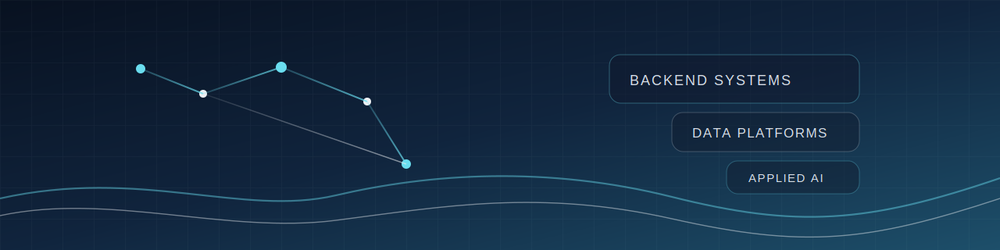

<h1 align="center">Abhishek Yeruva</h1>

<strong>Senior Backend / Platform Engineer building fintech and AI systems</strong>

Senior Engineer at Franklin Templeton · San Ramon, California · 10+ years

  <a href="https://www.linkedin.com/in/abhishekyeruva/">LinkedIn</a> ·
  <a href="https://github.com/abhishekreddy1206">GitHub</a> ·
  <a href="https://medium.com/@abhishekreddy1206">Medium</a> ·
  <a href="mailto:abhishekreddy1206@gmail.com">Email</a>

## What I Build

I build backend and platform systems where correctness, throughput, and observability matter: transaction processing, reconciliation workflows, ETL and data platforms, and service integrations that have to hold up under production load.

My recent public work also leans into applied AI: RAG search, evaluation-aware LLM workflows, and developer-facing products that combine structured data, document pipelines, and model-driven features.

Most of my day-to-day production work lives in private fintech repositories, so the public projects below are representative samples of how I design systems, not the full body of shipped work.

## Impact Snapshot

- Prevented roughly **$1M** in incorrect payments by fixing payout calculation and settlement bugs in a large-scale payments flow at Angi.
- Reduced database load by **~40%** by introducing distributed caching for high-throughput automotive retail services at Cox Automotive.
- Cut duplicate professional profiles by **15%** with PII-aware detection and merge workflows that improved trust and data quality.
- Reduced page-load issues by **30%** while leading feature delivery and performance fixes for a multi-team home services platform.

## Selected Work

### [ResumeForge](https://github.com/abhishekreddy1206/resumeforge)

AI-powered resume builder that parses resumes, analyzes job descriptions, and generates tailored PDF and DOCX outputs with application-support workflows.

Built with Next.js 16, TypeScript, Prisma, document processing pipelines, and AI orchestration modules around profile and job analysis.

Strong evidence of end-to-end product ownership, backend API design, integration-heavy workflows, and applied AI shipped as a usable product.

### [propKhoj](https://github.com/abhishekreddy1206/propKhoj)

Conversational property search platform that combines structured filters with RAG over a pgvector-backed real-estate dataset.

Built with Django, React, PostgreSQL with pgvector, OpenAI models, and analytics around chat quality and retrieval relevance.

Shows how I approach multi-service systems, search architecture, embeddings, and production-minded AI features beyond prototype demos.

### [emotion](https://github.com/abhishekreddy1206/emotion)

Facial emotion recognition project comparing multiple ML approaches and exposing the results through a FastAPI web app with live inference.

Built with Python, FastAPI, TensorFlow, transfer learning pipelines, evaluation scripts, and a lightweight web frontend.

Useful proof of hands-on model experimentation, inference API design, and the engineering work required to turn ML experiments into an interactive system.

## Core Strengths

- **Backend and distributed systems:** Python, Go, Java, microservices, REST and gRPC APIs, fault-tolerant processing, and service integrations.
- **Fintech data and reliability:** transaction flows, reconciliation, idempotent pipelines, data integrity, ETL, Snowflake, and Airflow.
- **Applied AI systems:** RAG, embeddings, prompt and workflow design, evaluation-minded AI products, agentic workflows, and developer tooling.
- **Cloud and platform engineering:** AWS, Docker, Kubernetes, CI/CD, observability, and pragmatic production operations.

## Writing and Community

I write occasionally on [Medium](https://medium.com/@abhishekreddy1206) about data engineering, cloud architecture, and applied AI systems. I use GitHub mostly to publish representative projects, document technical decisions clearly, and keep public work easy to evaluate.

Outside of engineering, I am a serious car enthusiast. I have owned 5+ cars over the years, and I have a collection of 1,000+ toy cars.

## Contact

If you are hiring for backend, platform, fintech infrastructure, or applied AI engineering roles, reach me at [abhishekreddy1206@gmail.com](mailto:abhishekreddy1206@gmail.com) or on [LinkedIn](https://www.linkedin.com/in/abhishekyeruva/).
